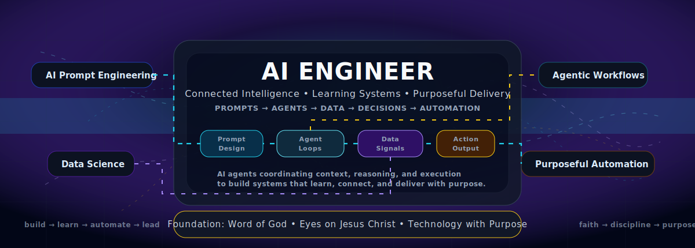

```mermaid
architecture-beta
    group wordofgod(mdi:book-open-page-variant)[Word of God]

    service purpose(mdi:target)[Purpose] in wordofgod
    service discipline(mdi:compass-outline)[Discipline] in wordofgod
    service ailearning(mdi:brain)[AI Learning] in wordofgod
    service promptengineering(mdi:message-text-outline)[Prompt Engineering] in wordofgod
    service aiagents(mdi:robot-outline)[AI Agents] in wordofgod
    service automationflows(mdi:autorenew)[Automation Flows] in wordofgod
    service softwareprojects(mdi:code-braces)[Software Projects] in wordofgod
    service collaborativeteams(mdi:account-group)[Collaborative Teams] in wordofgod
    service technologypurpose(mdi:earth)[Technology With Purpose] in wordofgod

    service datascience(mdi:database)[Data Science] in wordofgod
    service machinelearning(mdi:chart-scatter-plot)[Machine Learning] in wordofgod
    service robotics(mdi:robot-industrial)[Robotics] in wordofgod

    purpose:R -- L:discipline
    discipline:R -- L:ailearning
    ailearning:R -- L:promptengineering
    promptengineering:R -- L:aiagents
    aiagents:R -- L:automationflows
    automationflows:R -- L:softwareprojects
    softwareprojects:R -- L:collaborativeteams
    collaborativeteams:R -- L:technologypurpose

    ailearning:B -- T:datascience
    datascience:R -- L:machinelearning
    machinelearning:R -- L:robotics
    robotics:T -- B:automationflows

```

<p align="center">
  
</p>

<p align="center">
  <a href="https://joseavilez20.gitlab.io/my-portfolio/">
    
  </a>
  <a href="https://www.linkedin.com/in/joseavilespacheco/">
    
  </a>
  <a href="mailto:joseok56@gmail.com">
    
  </a>
</p>

<div align="center">
  <h2 >The Lord-Centered AI Prompt Engineer & Workflow Architect</h2>

  <p>
    <em>“And whatsoever ye do, do it heartily, as to the Lord, and not unto men;”</em><br/>
    <strong>Colossians 3:23</strong>
  </p>
</div>

<p align="center">
  
</p>

---

<table>
<tr>
<td width="58%" valign="top">

## Who I Am

I am building my professional path at the intersection of **Artificial Intelligence, software systems, automation, data, and collaborative execution**.

My focus is not only to use AI tools, but to design structured systems where **people, processes, AI agents, data, code, and decision-making** work together with clarity.

I am especially focused on:

* AI Prompt Engineering
* Agentic AI workflows
* AI-assisted software development
* Data Science and Machine Learning
* Cloud, DevOps, and scalable architecture
* Technology projects guided by purpose and disciplined execution

</td>
<td width="42%" valign="top">

## Foundation

My technical journey is connected to a deeper personal foundation:

> **Faith in Jesus Christ, obedience to the Word of God, discipline, humility, and purpose.**

I want my work to reflect more than knowledge. I want it to reflect **character, direction, service, and responsibility**.

Technology should not become vanity. It should serve a higher purpose.

</td>
</tr>
</table>

---

## Knowledge Architecture

<p align="center">
  
  
  
  
  
</p>



---

## Architecture of My Work

<p align="center">
  
  
  
  
  
  
</p>

```text
IDEA
  ↓
PURPOSE + REQUIREMENTS
  ↓
AI PROMPT ENGINEERING
  ↓
AGENTIC WORKFLOW DESIGN
  ↓
SOFTWARE / DATA / AUTOMATION
  ↓
VALIDATION + ITERATION
  ↓
USEFUL TECHNOLOGY SOLUTION
```

---

## Technical Focus

<table>
<tr>
<td width="50%" valign="top">

### AI & Data

* Prompt Engineering
* AI-assisted reasoning
* Data analysis
* Machine Learning foundations
* Intelligent automation
* Agent orchestration
* Knowledge workflows

</td>
<td width="50%" valign="top">

### Software & Delivery

* Software architecture
* GitHub workflows
* Cloud and DevOps learning
* Documentation systems
* Team execution flows
* Technical validation
* Product-oriented thinking

</td>
</tr>
</table>

---

## Principles

<table>
<tr>
<td width="50%" valign="top">

### Professional Principles

* Build with clarity
* Think in systems
* Learn continuously
* Execute with discipline
* Document decisions
* Validate before scaling
* Use AI as a force multiplier

</td>
<td width="50%" valign="top">

### Spiritual Principles

* Keep my eyes on Jesus Christ
* Stand on the Word of God
* Grow in obedience and humility
* Separate from vanity and distraction
* Serve with purpose
* Let character guide ambition

</td>
</tr>
</table>

---

## GitHub as a Living System

This profile represents a living architecture of growth:

<p align="center">
  <strong>Faith</strong> → <strong>Discipline</strong> → <strong>Learning</strong> → <strong>AI Systems</strong> → <strong>Software Projects</strong> → <strong>Purposeful Impact</strong>
</p>

<p align="center">
  <sub>
    My GitHub profile is a continuous record of learning, building, documenting, validating, and improving.
  </sub>
</p>

---

<p align="center">
  <strong>Building with intelligence. Growing with purpose. Standing on faith.</strong>
</p>

<p align="center">
  <sub>AI • Software • Automation • Leadership • Faith • Discipline • Purpose</sub>
</p>
