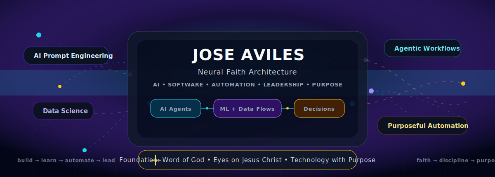
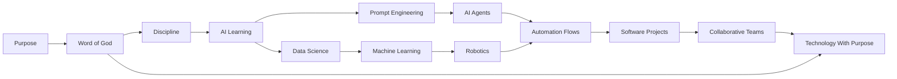

<!--
  GitHub Profile README — Neural Faith Architecture
  Author: Jose Aviles

  How to use:
  1. Create a repository with the same name as your GitHub username.
  2. Add this README.md in the root of that repository.
  3. Create an assets folder and add: assets/neural-faith-architecture.svg
  4. Replace the placeholder links below with your real GitHub, LinkedIn, portfolio, and email.
-->

<p align="center">
  
</p>

<h1 align="center">Jose Aviles</h1>

<h3 align="center">
  AI Prompt Engineering • Data Science • Machine Learning • AI Workflows • Automation • Purpose-Driven Technology
</h3>

<p align="center">
  <a href="https://joseavilez20.gitlab.io/my-portfolio/">
    
  </a>
  <a href="https://www.linkedin.com/in/joseavilespacheco/">
    
  </a>
  <a href="mailto:YOUR_EMAIL@example.com">
    
  </a>
</p>

<p align="center">
  
</p>

---

## Neural Faith Architecture

<table>
<tr>
<td width="58%" valign="top">

### Who I Am

I am building my professional path at the intersection of **Artificial Intelligence, software systems, automation, data, and collaborative execution**.

My focus is not only to use AI tools, but to design structured systems where **people, processes, AI agents, data, code, and decision-making** work together with clarity.

I am especially interested in:

- AI Prompt Engineering
- Data Science and Machine Learning
- Robotics and automation concepts
- Agentic AI workflows
- AI-assisted software development
- Cloud, DevOps, and scalable architecture
- Collaborative teams supported by artificial intelligence
- Technology projects guided by purpose and disciplined execution

</td>
<td width="42%" valign="top">

### Foundation

My technical journey is connected to a deeper personal foundation:

> **Faith in Jesus Christ, obedience to the Word of God, discipline, humility, and purpose.**

I want my work to reflect more than knowledge. I want it to reflect **character, direction, service, and responsibility**.

Technology should not become vanity. It should serve a higher purpose.

</td>
</tr>
</table>

---

## Dynamic Knowledge Network

<p align="center">
  
  
  
  
  
</p>



---

## Current Building Direction

<table>
<tr>
<td align="center" width="25%">

### AI Systems

Prompt design, AI workflows, agent behavior, structured instructions, and practical AI use cases.

</td>
<td align="center" width="25%">

### Software Architecture

Designing clear technical flows that connect frontend, backend, cloud, data, automation, and delivery.

</td>
<td align="center" width="25%">

### Team Orchestration

Using AI to improve collaboration, task clarity, role definition, validation, documentation, and execution.

</td>
<td align="center" width="25%">

### Purpose & Discipline

Growing with spiritual direction, humility, focus, obedience, and separation from empty distractions.

</td>
</tr>
</table>

---

## Architecture of My Work

<p align="center">
  
  
  
  
  
  
</p>

```text
IDEA
  ↓
PURPOSE + REQUIREMENTS
  ↓
AI PROMPT ENGINEERING
  ↓
AGENTIC WORKFLOW DESIGN
  ↓
SOFTWARE / DATA / AUTOMATION
  ↓
VALIDATION + ITERATION
  ↓
USEFUL TECHNOLOGY SOLUTION
```

---

## Technical Focus

<table>
<tr>
<td width="50%" valign="top">

### AI & Data

- Prompt Engineering
- AI-assisted reasoning
- Data analysis
- Machine Learning foundations
- Intelligent automation
- Agent orchestration
- Knowledge workflows

</td>
<td width="50%" valign="top">

### Software & Delivery

- Software architecture
- GitHub workflows
- Cloud and DevOps learning
- Documentation systems
- Team execution flows
- Technical validation
- Product-oriented thinking

</td>
</tr>
</table>

---

## Principles

<table>
<tr>
<td width="50%" valign="top">

### Professional Principles

- Build with clarity
- Think in systems
- Learn continuously
- Execute with discipline
- Document decisions
- Validate before scaling
- Use AI as a force multiplier

</td>
<td width="50%" valign="top">

### Spiritual Principles

- Keep my eyes on Jesus Christ
- Stand on the Word of God
- Grow in obedience and humility
- Separate from vanity and distraction
- Serve with purpose
- Let character guide ambition

</td>
</tr>
</table>

---

## GitHub as a Living System

This profile represents a living architecture of growth:

<p align="center">
  <strong>Faith</strong> → <strong>Discipline</strong> → <strong>Learning</strong> → <strong>AI Systems</strong> → <strong>Software Projects</strong> → <strong>Purposeful Impact</strong>
</p>

<p align="center">
  
</p>

<p align="center">
  
</p>

---

## Connect

<p align="center">
  <a href="https://github.com/joseavilez20">
    
  </a>
  <a href="https://www.linkedin.com/in/joseavilespacheco/">
    
  </a>
  <a href="mailto:YOUR_EMAIL@example.com">
    
  </a>
</p>

---

<p align="center">
  <strong>Building with intelligence. Growing with purpose. Standing on faith.</strong>
</p>

<p align="center">
  <sub>AI • Software • Automation • Leadership • Faith • Discipline • Purpose</sub>
</p>
